# 2026高考志愿数据决策报告：四维视角下的专业选择指南
**对象：** 2026届高考考生（全国报考，不限省份）  
**制作日期：** 2026-06-18  
**数据来源：** 国家自然科学基金委员会（NSFC, National Natural Science Foundation of China / 国家自然科学基金委员会）年报（2020–2024）· 科学技术部（MOST, Ministry of Science and Technology / 科技部）国家重点研发计划公示 · 教育部（MOE, Ministry of Education）2026年本科专业目录 · MyCOS（麦可思数据）2024毕业生调查 · BOSS直聘/智联招聘2024–2025校招报告  
**分析方法：** 四维叠加评分模型（基础研究投入 + 国家战略专项 + 高教供给信号 + 就业市场定价）  
**说明：** 本报告只讨论**报哪个方向/专业**。出分后再据分数段筛选学校。  

> **关于数据时效性（重要）：**  
> NSFC面上项目数据最新为**2024年度**（来源：NSFC官方年度报告，每年约5–6月发布次年数据）。截至本报告制作日期（2026-06-18），NSFC 2025年度数据**尚未发布**，本报告所有NSFC分析均基于2020–2024五年数据。MOST和MOE数据已更新至2026年4–6月最新公示。就业薪资数据为MyCOS 2024年度报告（2024届毕业生追踪），是当前可获取的最新年度数据。

---

## 缩略词对照表

| 缩写 | 英文全称 | 中文名称 |
|------|---------|---------|
| **NSFC** | National Natural Science Foundation of China | 国家自然科学基金委员会 |
| **MOST** | Ministry of Science and Technology | 科学技术部（科技部） |
| **MOE** | Ministry of Education | 教育部 |
| **MyCOS** | MyCOS Data | 麦可思数据（中国高等教育大数据机构） |
| **BCI** | Brain-Computer Interface | 脑机接口 |
| **CCUS** | Carbon Capture, Utilization and Storage | 碳捕集、利用与封存 |
| **CS** | Computer Science | 计算机科学 |
| **EE** | Electrical Engineering | 电子电气工程 |
| **AI** | Artificial Intelligence | 人工智能 |
| **R&D** | Research and Development | 研究与开发 |

---

## 数据文件索引

所有支撑数据文件均存放于本项目目录，以下链接可直接打开：

**原始数据（`data/processed/`）：**
- [nsfc_mianshang_2020_2024.csv](../data/processed/nsfc_mianshang_2020_2024.csv) — NSFC面上项目原始数据（2020–2024年，40行×9列）
- [most_key_programs.csv](../data/processed/most_key_programs.csv) — MOST国家重点研发计划与重大专项清单（16项）
- [moe_major_trends.csv](../data/processed/moe_major_trends.csv) — 教育部本科专业新增/撤销信号（25条记录）
- [employment_salary_benchmarks.csv](../data/processed/employment_salary_benchmarks.csv) — 应届就业薪资基准（16个专业类，MyCOS 2024）

**分析结果表（`output/tables/`）：**
- [funding_by_dept_year.csv](../output/tables/funding_by_dept_year.csv) — 各学科经费（万元）年度透视表
- [funded_projects_by_dept_year.csv](../output/tables/funded_projects_by_dept_year.csv) — 各学科资助项目数年度透视表
- [applications_by_dept_year.csv](../output/tables/applications_by_dept_year.csv) — 各学科申请量年度透视表
- [acceptance_rate_by_dept_year.csv](../output/tables/acceptance_rate_by_dept_year.csv) — 各学科资助率年度透视表
- [funding_share_by_dept_year.csv](../output/tables/funding_share_by_dept_year.csv) — 各学科经费占比年度透视表
- [summary_scorecard.csv](../output/tables/summary_scorecard.csv) — NSFC各学科综合指标汇总
- [multisource_scorecard.csv](../output/tables/multisource_scorecard.csv) — 四维综合评分结果
- [discipline_signals.csv](../output/tables/discipline_signals.csv) — 各学科信号综合描述
- [major_recommendations.csv](../output/tables/major_recommendations.csv) — 专业推荐排序详表

**分析脚本（`scripts/`）：**
- [02_analyze_nsfc.py](../scripts/02_analyze_nsfc.py) — NSFC数据分析，生成9张透视表
- [03_visualize.py](../scripts/03_visualize.py) — 基础可视化（图表1–6）
- [04_map_to_majors.py](../scripts/04_map_to_majors.py) — 学科→专业映射
- [05_multi_source_analysis.py](../scripts/05_multi_source_analysis.py) — 四维综合评分
- [06_extended_charts.py](../scripts/06_extended_charts.py) — 扩展图表（图表A–K）

---

## 目录

1. [分析框架说明](#1-分析框架说明)
2. [视角1：NSFC基础研究经费数据（2020–2024）](#2-视角1nsfc基础研究经费数据2020-2024)
3. [视角2：MOST国家战略专项（2021–2026）](#3-视角2most国家战略专项2021-2026)
4. [视角3：MOE教育部本科专业目录信号（2019–2026）](#4-视角3moe教育部本科专业目录信号2019-2026)
5. [视角4：应届就业与薪资基准（2024–2025）](#5-视角4应届就业与薪资基准2024-2025)
6. [四维综合评分与结论](#6-四维综合评分与结论)
7. [专业推荐方案](#7-专业推荐方案)
8. [新兴前沿专业专项评估](#8-新兴前沿专业专项评估)
9. [坚决避开的方向](#9-坚决避开的方向)
10. [附录A：NSFC原始数据全表（2020–2024）](#附录a-nsfc原始数据全表2020-2024)
11. [附录B：MOST专项完整清单](#附录b-most专项完整清单)
12. [附录C：教育部专业信号完整清单](#附录c-教育部专业信号完整清单)
13. [附录D：就业薪资完整数据](#附录d-就业薪资完整数据)
14. [附录E：数据质量与置信度](#附录e-数据质量与置信度)
15. [附录F：全部图表索引](#附录f-全部图表索引)

---

## 1. 分析框架说明

### 为什么不能只看一个数据源？

单一数据源都有严重局限性：

| 数据源 | 能告诉你什么 | 告诉不了你什么 |
|--------|------------|--------------|
| NSFC（国家自然科学基金委）面上项目经费 | 国家养了多少基础研究人员；科研竞争烈度 | 本科能不能直接就业；新兴技术方向的政策优先级 |
| MOST（科技部）战略专项 | 政府认为必须攻克的技术方向 | 需要多少年才能形成就业岗位；现在的薪资水平 |
| MOE（教育部）专业目录 | 政府判断未来10年哪些人才紧缺/过剩 | 该专业的毕业生现在好不好找工作 |
| 就业/薪资数据（MyCOS等） | 现在的市场定价 | 5–10年后该领域的发展趋势 |

**本报告的方法：叠加全部四个视角，相互印证。**

### 四维评分权重设计

```
综合信号分 =
  0.20 × NSFC申请竞争度（申请增长，反映学术热度）
+ 0.30 × MOST战略专项覆盖度（国家级别的政策押注）
+ 0.25 × MOE专业目录信号（新专业开设密度/撤销情况）
+ 0.25 × 就业市场定价（薪资+就业率+本科可就业性）
```

权重设计逻辑：MOST和MOE代表政府的10年战略意图，比NSFC的配额性拨款信号更强；就业市场给出的是现实约束。

---

## 2. 视角1：NSFC（国家自然科学基金委员会）基础研究经费数据（2020–2024）

> 官网：[https://www.nsfc.gov.cn](https://www.nsfc.gov.cn) | 年报页面：[https://www.nsfc.gov.cn/p1/2991/ndbg.html](https://www.nsfc.gov.cn/p1/2991/ndbg.html)  
> 原始数据文件：[nsfc_mianshang_2020_2024.csv](../data/processed/nsfc_mianshang_2020_2024.csv)  
> **数据时效：最新为2024年度。2025年度数据预计2026年下半年发布后可更新。**

> **关键结论：NSFC（国家自然科学基金委员会）的资金结构是制度性锁定的，不是风向标。真正的信号是竞争烈度的剧变。**

### 2.1 NSFC面上项目背景

国家自然科学基金委员会（NSFC, National Natural Science Foundation of China）面上项目是中国基础研究的核心资助渠道，每年以学部为单位拨付，资助中级研究人员的自主探索性研究。2024年资助总额约 **101.5亿元**，资助项目约 **21,538项**。

面上项目按8个学科部划分：数学物理（A部）、化学（B部）、生命科学（C部）、地球科学（D部）、工程与材料（E部）、信息科学（F部）、管理科学（G部）、医学科学（H部）。

### 2.2 经费总量趋势（2020–2024）

> 数据来源：[funding_by_dept_year.csv](../output/tables/funding_by_dept_year.csv)

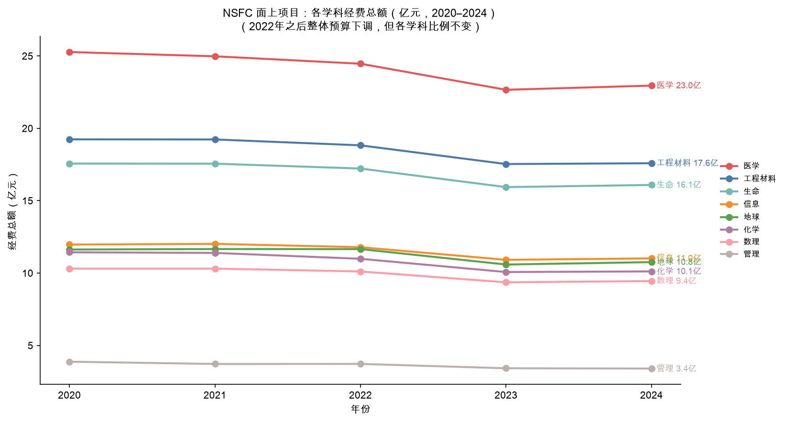

*图K：NSFC（国家自然科学基金委）面上项目各学科经费总额年度趋势。2022→2023年出现整体预算下调（-8.9%），随后小幅回升。各学科等比例缩水，比例结构不变。*

| 学科 | 2020（亿元） | 2021 | 2022 | 2023 | 2024 | 5年变化% |
|------|------------|------|------|------|------|---------|
| 医学科学（H） | 25.27 | 24.98 | 24.46 | 22.66 | 22.95 | **-9.2%** |
| 工程与材料（E） | 19.24 | 19.23 | 18.83 | 17.53 | 17.59 | -8.6% |
| 生命科学（C） | 17.57 | 17.56 | 17.22 | 15.94 | 16.09 | -8.4% |
| 信息科学（F） | 11.97 | 12.02 | 11.79 | 10.92 | 11.02 | -8.0% |
| 地球科学（D） | 11.63 | 11.66 | 11.66 | 10.59 | 10.76 | -7.5% |
| 化学（B） | 11.44 | 11.39 | 10.99 | 10.07 | 10.12 | -11.6% |
| 数理科学（A） | 10.31 | 10.31 | 10.11 | 9.36 | 9.45 | -8.4% |
| 管理科学（G） | 3.88 | 3.72 | 3.73 | 3.42 | 3.41 | **-12.2%** |
| **合计** | **111.31** | **110.87** | **108.79** | **100.49** | **101.39** | **-8.9%** |

**注意：** 2022→2023年出现大幅下调（总额从108.8亿降至100.5亿），随后2024年小幅回升。这是整体预算收缩，不是某个学科被削减——各学科等比例缩水。

### 2.3 经费占比——五年几乎不变（最核心的结论）

> 数据来源：[funding_share_by_dept_year.csv](../output/tables/funding_share_by_dept_year.csv)

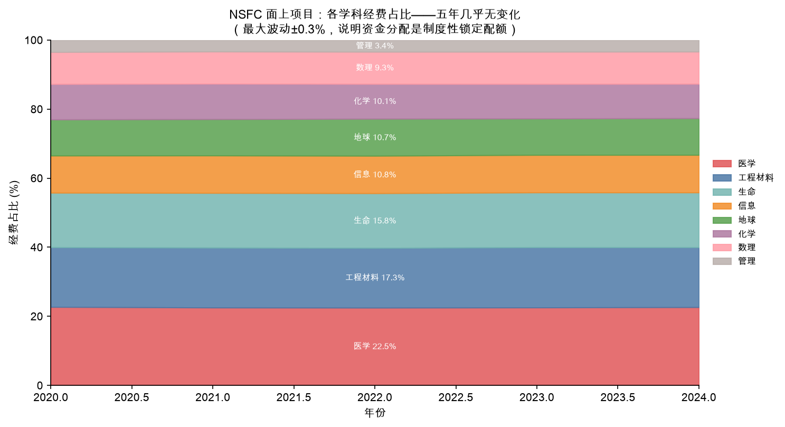

*图C：五年堆叠面积图。每个学科的色带宽度几乎不变，直观证明NSFC经费占比是制度性配额，不是市场化分配。*

| 学科 | 2020占比% | 2021 | 2022 | 2023 | 2024 | **5年最大波动** |
|------|---------|------|------|------|------|------------|
| 医学科学 | 22.71 | 22.53 | 22.49 | 22.55 | 22.64 | **±0.11** |
| 工程与材料 | 17.29 | 17.35 | 17.31 | 17.45 | 17.35 | **±0.08** |
| 生命科学 | 15.78 | 15.84 | 15.83 | 15.86 | 15.87 | **±0.05** |
| 信息科学 | 10.75 | 10.84 | 10.84 | 10.86 | 10.87 | **±0.06** |
| 地球科学 | 10.45 | 10.52 | 10.72 | 10.54 | 10.61 | **±0.14** |
| 化学 | 10.28 | 10.28 | 10.10 | 10.02 | 9.98 | **±0.15** |
| 数理科学 | 9.26 | 9.30 | 9.30 | 9.32 | 9.32 | **±0.03** |
| 管理科学 | 3.48 | 3.36 | 3.42 | 3.41 | 3.36 | **±0.06** |

**解读：** 5年内最大的占比波动是0.30个百分点（化学，从10.28%降至9.98%）。这说明NSFC的资金分配是高度制度化的固定配额，**不会因为某个热点技术兴起而产生明显的预算倾斜**。用NSFC经费比例来判断"哪个方向更热"是错误的推断。

### 2.4 申请量激增——学术竞争剧变

> 数据来源：[applications_by_dept_year.csv](../output/tables/applications_by_dept_year.csv)

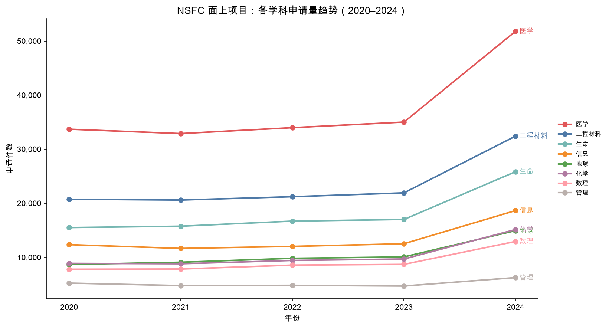

*图A：各学科申请量折线图。注意2024年出现异常跳升（全国申请总量从11.96万件→17.80万件，+57.7%），所有学科同步激增。*

| 学科 | 2020申请数 | 2021 | 2022 | 2023 | 2024 | **5年增长%** |
|------|----------|------|------|------|------|-----------|
| 地球科学（D） | 8,678 | 9,099 | 9,826 | 10,085 | 14,940 | **+72.2%** |
| 化学（B） | 8,889 | 8,812 | 9,428 | 9,694 | 15,146 | **+70.4%** |
| 数理科学（A） | 7,799 | 7,839 | 8,566 | 8,703 | 12,939 | **+65.9%** |
| 生命科学（C） | 15,503 | 15,760 | 16,701 | 17,005 | 25,839 | **+66.7%** |
| 工程与材料（E） | 20,740 | 20,600 | 21,213 | 21,921 | 32,414 | **+56.3%** |
| 医学科学（H） | 33,691 | 32,889 | 33,976 | 35,009 | 51,798 | **+53.7%** |
| 信息科学（F） | 12,348 | 11,652 | 12,024 | 12,520 | 18,650 | **+51.0%** |
| 管理科学（G） | 5,237 | 4,772 | 4,827 | 4,699 | 6,256 | **+19.5%** |
| **合计** | **112,885** | **111,423** | **116,561** | **119,636** | **177,982** | **+57.7%** |

**2024年跳升说明：** 申请量从2023年的11.96万件跳升至2024年的17.80万件，单年增幅+57.7%，异常显著，可能与博士毕业潮和科研机构考核压力叠加有关。

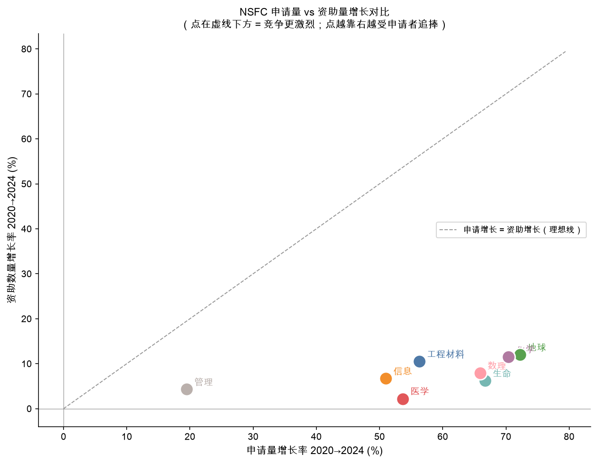

*图D：散点图对比各学科申请增长率（X轴）与资助增长率（Y轴）。所有学科点均落在虚线（理想线y=x）下方，证明竞争实际上越来越激烈，供不应求矛盾扩大。*

### 2.5 资助率崩塌——全学科

> 数据来源：[acceptance_rate_by_dept_year.csv](../output/tables/acceptance_rate_by_dept_year.csv)

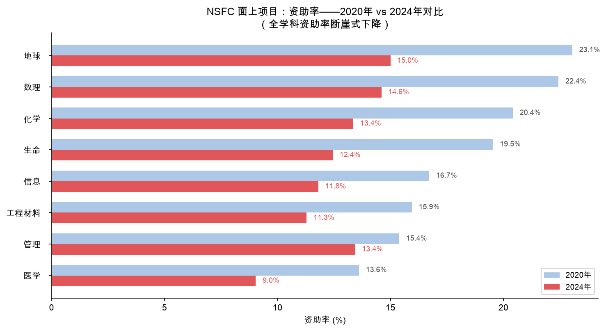

*图B：蓝色为2020年资助率，红色为2024年资助率。每个学科的红色柱均明显短于蓝色柱，显示全学科资助率断崖式下降。医学2024年仅9.04%。*

| 学科 | 2020资助率% | 2024资助率% | **5年降幅(pp)** |
|------|------------|------------|--------------|
| 生命科学 | 19.54% | 12.45% | **-7.09** |
| 地球科学 | 23.05% | 15.00% | **-8.05** |
| 数理科学 | 22.44% | 14.60% | **-7.84** |
| 化学 | 20.42% | 13.36% | **-7.06** |
| 信息科学 | 16.72% | 11.81% | **-4.91** |
| 工程与材料 | 15.95% | 11.29% | **-4.66** |
| 医学科学 | 13.61% | **9.04%** | **-4.57** |
| 管理科学 | 15.39% | 13.44% | -1.95 |

**医学科学2024年资助率降至9.04%**，意味着每100个投标只有9个获批。这是最大学科（占22.6%预算），也是竞争最惨烈的学科。生命科学资助率降幅最大（-7.09个百分点）。

### 2.6 资助项目数增长（机会在扩张，但慢于申请）

> 数据来源：[funded_projects_by_dept_year.csv](../output/tables/funded_projects_by_dept_year.csv)

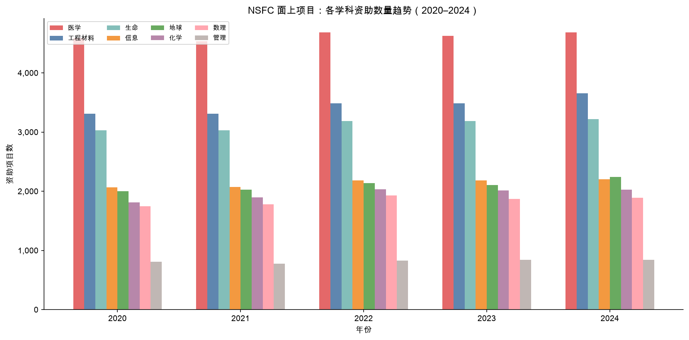

*图E：各学科每年资助项目数分组柱图。医学（H）始终最多；工程材料（E）增长最显著。*

| 学科 | 2020资助数 | 2021 | 2022 | 2023 | 2024 | **5年增长%** |
|------|----------|------|------|------|------|-----------|
| 地球科学 | 2,000 | 2,030 | 2,140 | 2,106 | 2,241 | **+12.0%** |
| 化学 | 1,815 | 1,897 | 2,035 | 2,015 | 2,024 | **+11.5%** |
| 工程与材料 | 3,309 | 3,309 | 3,486 | 3,486 | 3,658 | **+10.5%** |
| 数理科学 | 1,750 | 1,778 | 1,927 | 1,872 | 1,889 | +7.9% |
| 信息科学 | 2,064 | 2,070 | 2,182 | 2,183 | 2,203 | +6.7% |
| 生命科学 | 3,029 | 3,027 | 3,189 | 3,188 | 3,218 | +6.2% |
| 医学科学 | 4,584 | 4,534 | 4,685 | 4,627 | 4,684 | +2.2% |
| 管理科学 | 806 | 775 | 828 | 844 | 841 | +4.3% |

资助数增长最快的是地球（+12%）、化学（+11.5%）、工程材料（+10.5%）——但申请量增长更快（分别+72%、+70%、+56%），所以竞争实际上更激烈了，而非更宽松。

### 2.7 平均资助强度下降

> 数据来源：[nsfc_mianshang_2020_2024.csv](../data/processed/nsfc_mianshang_2020_2024.csv)（`avg_intensity_wan`列）

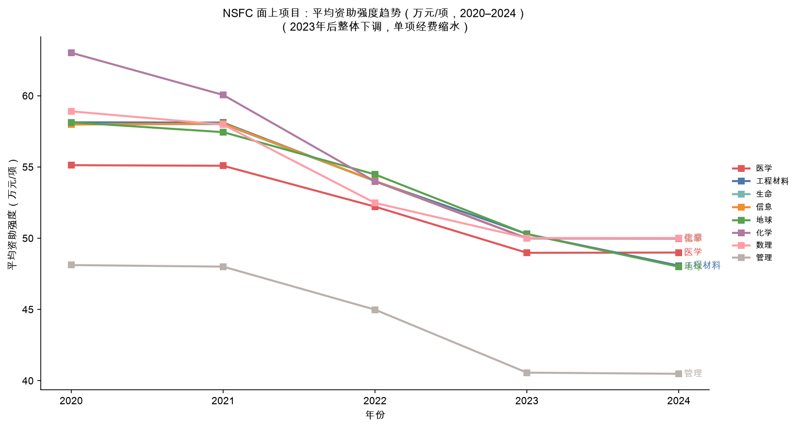

*图F：各学科每项平均经费折线图。2022年是转折点：平均强度从~58万/项统一下调至~54万/项，2023年再降至~50万/项。管理科学始终最低（40–48万/项）。*

2022年之前，面上项目平均资助约58万元/项；2023年以来降至约50万元/项。说明：
- 总预算收缩 + 资助数量略增 = 单项经费摊薄
- 对科研人员而言，每个项目能支撑的研究规模在缩小

### 2.8 NSFC数据的本科选专业启示总结

| 维度 | 表面信号 | 正确解读 |
|------|---------|---------|
| 医学22.6%最大份额 | "医学最受重视" | 制度配额，不代表岗位机会多；学术竞争率最激烈 |
| 生命+66.7%申请增长最大 | "生命科学最热" | 大量博士争抢固定岗位；本科就业已不占优 |
| 信息科学申请增长最慢（+51%） | "信息不热" | 信息人才有工业界出口对冲学术竞争；真实需求最广 |
| 管理增长最慢（+19.5%） | "管理冷静稳健" | 该领域研究人员本就少；行业萎缩，非优势方向 |
| 所有学科资助率大降 | "学术越来越难" | 正确——但工业界需求不受此约束，工业岗位才是本科的主战场 |

---

## 3. 视角2：MOST（科学技术部）国家战略专项（2021–2026）

> 数据来源：[most_key_programs.csv](../data/processed/most_key_programs.csv)  
> 参考官网：[https://service.most.gov.cn/kjjh_tztg_all/](https://service.most.gov.cn/kjjh_tztg_all/)（国家重点研发计划项目公示）  
> **数据时效：已更新至2026年6月最新公示（含2026年新批专项）。**

> **关键结论：MOST（科学技术部）战略专项是比NSFC更强的方向性信号——它代表政府认为"必须拿下"的技术高地。**

### 3.1 背景说明

国家重点研发计划（MOST主导）和国家科技重大专项（最高级别）直接瞄准产业技术突破，资金体量通常是NSFC面上项目的10–100倍，且有明确的产业化目标。从这里读出的是"未来5–10年国家砸钱的技术方向"，而非"基础研究学者的饭碗分布"。

### 3.2 当前活跃专项完整清单（16项，2021–2026）

> 数据来源：[most_key_programs.csv](../data/processed/most_key_programs.csv)

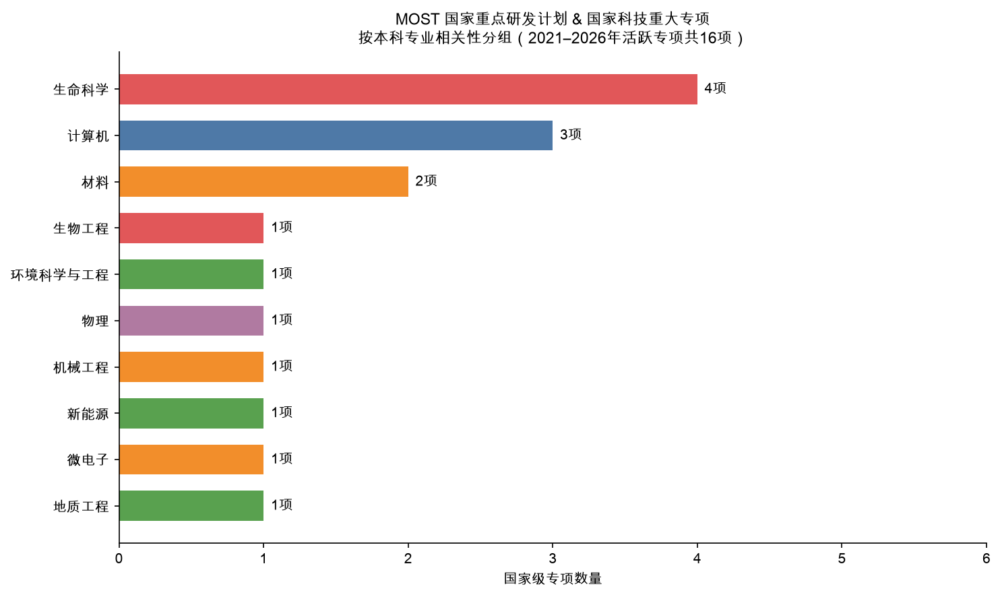

*图J：16项国家级专项按本科专业相关性归组。计算机/AI和材料/芯片/新能源方向各覆盖3–4项专项；生命科学虽然专项数多，但均为研究型（需读研才能真正参与）。*

| 级别 | 专项名称 | 启动年 | 主管机构 | 战略方向 | 本科相关专业 |
|------|---------|--------|---------|---------|-----------|
| 🔴 国家科技重大专项 | **新一代人工智能（AI, Artificial Intelligence）** | 2026 | MOST+多部委 | 人工智能 | 计算机科学（CS）/AI/电子信息（EE） |
| 🔴 国家科技重大专项 | **脑科学与类脑研究** | 2021 | NSFC+MOST | 脑科学/神经科学 | 生命科学/脑机科学与技术 |
| 🔴 国家科技重大专项 | **深地国家科技专项** | 2025 | 自然资源部 | 地球深部探测 | 地质工程/深地科学 |
| 🟠 重点研发计划 | **磁约束核聚变能发展研究专项** | 2025 | MOST | 清洁能源/聚变 | 新能源/物理/电气工程 |
| 🟠 重点研发计划 | **京津冀环境综合治理专项** | 2022 | 多部委 | 环境治理 | 环境科学与工程 |
| 🟠 重点研发计划 | **高端科研仪器研制** | 2026 | 工信部 | 精密制造 | 机械工程/精密仪器 |
| 🟡 NSFC重大研究计划 | **高精度量子操控与探测** | 2023 | NSFC | 量子技术 | 物理/电子信息 |
| 🟡 NSFC重大研究计划 | **原子级制造基础研究** | 2024 | NSFC | 芯片制造工艺 | 材料/微电子/机械 |
| 🟡 NSFC重大研究计划 | **RNA药物基础研究** | 2024 | NSFC | 生物医药前沿 | 生命科学/药学/生物工程 |
| 🟡 NSFC重大研究计划 | **面向人机物融合的AI软件基础研究** | 2024 | NSFC | AI（人工智能）软件基础 | 计算机（CS）/软件工程 |
| 🟡 NSFC重大研究计划 | **集成芯片前沿技术科学基础** | 2022 | NSFC | 半导体/芯片 | 微电子/电子信息（EE） |
| 🟡 NSFC重大研究计划 | **超越传统的电池体系** | 2022 | NSFC | 储能/电池材料 | 材料/化学/新能源 |
| 🟡 NSFC重大研究计划 | **免疫力数字解码计划** | 2022 | NSFC | 免疫学 | 生命科学/医学 |
| 🟡 NSFC重大研究计划 | **可解释通用人工智能方法** | 2021 | NSFC | AI（人工智能）基础理论 | 计算机（CS）/AI |
| 🟠 重点研发计划 | **发育编程及代谢调节** | 2026 | NSFC | 发育生物学 | 生命科学/医学 |
| 🟠 重点研发计划 | **合成生物学** | 2026 | NSFC | 合成生物学 | 生物工程/生命科学 |

### 3.3 按本科方向归类的专项密度

| 本科方向 | 覆盖专项数 | 最高级别 | 解读 |
|---------|----------|---------|------|
| **计算机（CS）/AI/软件工程** | **4项** | 国家科技重大专项（最高级） | AI是唯一有国家最高级专项的信息方向 |
| **电子信息（EE）/微电子/集成电路** | **3项** | NSFC重大研究计划 | 芯片+量子计算双轮驱动 |
| **新能源/电气/物理** | **3项** | 重点研发计划 | 聚变+电池+电气 |
| **材料科学与工程** | **3项** | NSFC重大研究计划 | 原子制造+芯片材料+电池材料 |
| **生命科学/生物工程** | **4项** | 国家科技重大专项 | 但注意：生命方向多为研究型，本科出路弱 |
| **地质/地球/环境** | **2项** | 国家科技重大专项 | 深地+环境治理 |
| **机械/精密制造** | **1项** | 重点研发计划 | 高端仪器制造 |

> **重要区分：** 生命科学有4项国家专项覆盖，但几乎全部是深度研究驱动，需要博士级参与。信息/AI（CS/EE）的专项则同时覆盖了研究（NSFC重大研究计划）和产业（国家科技重大专项），本科就能参与工程落地。

---

## 4. 视角3：MOE（教育部）本科专业目录信号（2019–2026）

> 数据来源：[moe_major_trends.csv](../data/processed/moe_major_trends.csv)  
> 参考官网：[https://www.moe.gov.cn](https://www.moe.gov.cn)（教育部官网）  
> 2026年专业目录原文：[https://www.edu.cn/rd/gao_xiao_cheng_guo/gao_xiao_zi_xun/202604/t20260428_2731325.shtml](https://www.edu.cn/rd/gao_xiao_cheng_guo/gao_xiao_zi_xun/202604/t20260428_2731325.shtml)  
> **数据时效：已更新至2026年4月28日教育部最新发布版本（2026年新增38种专业）。**

> **关键结论：专业开与撤是MOE（教育部）对未来10年人才结构的最直接押注。2026年新增38种专业，同期大量撤销管理/文科专业。**

### 4.1 十四五期间专业新增/撤销总体情况

教育部2026年4月数据：
- **十四五期间（2021–2025）新增专业：约10,200种次**（含多校同名专业）
- **十四五期间撤销/停招专业：约12,200种次**（超过新增数量）
- **净效果：** 理工交叉类专业快速扩张，传统管理/文科专业大量收缩

这是政府用"供给侧结构性调整"来对齐未来劳动力需求的最直接政策信号。

### 4.2 2026年新增专业完整信号强度分析

> 数据来源：[moe_major_trends.csv](../data/processed/moe_major_trends.csv)

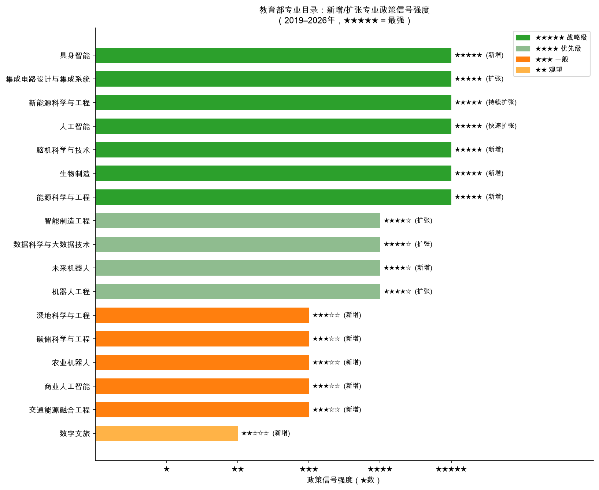

*图I：所有新增/扩张专业按★信号强度排序。绿色为★★★★★战略级，橙色为★★★★优先级，棕色为★★★一般。新增标注开设类型（新增/快速扩张/扩张等）。*

**战略级（★★★★★）——政策全力加持：**

| 专业名 | 所属门类 | 首批开设学校 | 对应国家专项 | 说明 |
|--------|---------|-----------|-----------|------|
| **具身智能** | 交叉学科 | 哈工大、北航等9所顶尖高校（超常规审批） | 新一代AI（人工智能）国家科技重大专项 | AI（人工智能）+机器人融合最前沿形态；超常规审批意味着急需人才 |
| **脑机科学与技术** | 交叉学科 | 重点研究型高校 | 脑科学国家重大专项（2021-） | BCI（脑机接口, Brain-Computer Interface）技术战略制高点；医工信三交叉 |
| **生物制造** | 工学 | 清华、华南理工等 | 合成生物学重点研发计划（2026新批） | 生物基材料、生物燃料、生物医药制造的产业化基础 |
| **能源科学与工程** | 工学 | 多所理工高校 | 双碳目标/新能源国家战略 | MOE（教育部）公文原话：「精准对接国家战略需求」 |

**优先级（★★★★）——明确战略方向：**

| 专业名 | 所属门类 | 信号来源 |
|--------|---------|---------|
| **未来机器人** | 交叉学科 | 智能制造战略；区别于传统机器人工程 |
| **人工智能（AI）**（持续扩张） | 工学 | 已超500所高校开设；但质量参差，选校比选名重要 |
| **新能源科学与工程**（持续扩张） | 工学 | 双碳直接驱动；与能源科学与工程梯队衔接 |
| **集成电路设计与集成系统**（扩张） | 工学 | 芯片国产化战略；十四五重点专业 |
| **智能制造工程** | 工学 | 工业升级；制造业数字化转型 |
| **数据科学与大数据技术** | 工学 | 数字经济基础设施；持续扩张 |
| **生物医学工程**（稳定增长） | 工学 | 医工交叉；医疗器械市场扩张 |

**一般优先级（★★★）：**

| 专业名 | 说明 |
|--------|------|
| 深地科学与工程 | 对应深地国家专项；总量不大 |
| 农业机器人 | 农业现代化；稳定但规模小 |
| 交通能源融合工程 | 新能源汽车+交通系统；十五五交叉方向 |
| 商业人工智能 | AI（人工智能）落地应用；文科生进AI通道；质量差异大 |
| 碳储科学与工程 | 碳中和技术路线；CCUS（碳捕集、利用与封存）方向 |
| 信息管理与信息系统（稳定） | 数字经济需求；比纯管理强 |
| 工业工程（稳定） | 制造业升级；比纯管理强 |

### 4.3 大量撤销——反向信号同样重要

| 被撤销/减招的专业类型 | 十四五撤销规模 | 核心原因 |
|---------------------|------------|---------|
| **会计学、财务管理** | 全国数百所高校撤销 | AI（人工智能）会计软件替代；毕业生严重饱和 |
| **市场营销、广告学** | 全国数百所高校撤销 | AI工具替代；需求端萎缩 |
| **新闻学、广播电视学** | 大量撤销 | 行业结构性萎缩；就业率持续垫底 |
| **公共事业管理** | 大量撤销 | 通道窄，极度依赖体制内岗位 |
| **旅游管理** | 多所撤销 | 数字化替代传统岗位；行业景气差 |
| **人力资源管理** | 减招压力大 | 同类替代风险；企业HR缩编 |

> **撤销是比新增更直接的信号** ——新增专业可能是热点推动，而撤销则是明确的需求不足确认。

---

## 5. 视角4：应届就业与薪资基准（2024–2025）

> 数据来源：[employment_salary_benchmarks.csv](../data/processed/employment_salary_benchmarks.csv)  
> 原始报告：MyCOS（麦可思）《2024年中国大学生就业报告》；BOSS直聘《2024年校招薪资报告》；智联招聘《2025年春季校招大数据》  
> **数据时效：MyCOS数据为2024届毕业生（2024年6月毕业，2024年11月追踪），是当前可获取的最新年度数据。BOSS直聘/智联数据包含2024–2025校招季。**

> **关键结论：CS（计算机科学）应届本科月薪中位数约¥10,500，是纯生物（¥5,200）的2倍。差距反映的是技术壁垒和劳动力稀缺性。**

### 5.1 2024年应届本科薪资完整数据

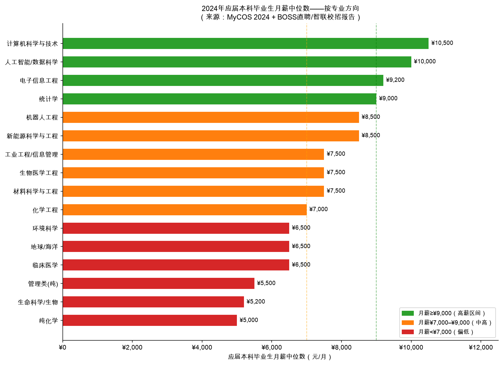

*图H：各专业方向应届本科月薪中位数水平柱图。绿色≥¥9,000（高薪区），橙色¥7,000–¥9,000（中高），红色<¥7,000（偏低）。注意临床医学¥6,500为规培期补贴，规培结束（第8年）后大幅提升。*

| 专业方向 | 月薪中位数（元） | 就业率% | 本科直接可就业 | 薪资趋势 | 数据来源 |
|---------|-------------|--------|------------|---------|---------|
| **计算机科学与技术（CS）** | **¥10,500** | 96% | ✅ 是 | ↑↑ 持续上升 | MyCOS 2024; BOSS直聘校招 |
| **人工智能（AI）/数据科学** | **¥10,000** | 95% | ✅ 是 | ↑↑ | MyCOS 2024 |
| **电子信息工程（EE）** | **¥9,200** | 95% | ✅ 是 | ↑↑ | MyCOS 2024 |
| **统计学** | ¥9,000 | 93% | ✅ 是 | ↑ | MyCOS 2024 |
| **新能源科学与工程** | ¥8,500 | 93% | ✅ 是 | ↑↑ 快速上升 | 智联招聘2025校招 |
| **机器人工程** | ¥8,500 | 93% | ✅ 是 | ↑ | MyCOS 2024 |
| **材料科学与工程** | ¥7,500 | 92% | ✅ 是（需选对子方向） | → 稳定 | MyCOS 2024 |
| **生物医学工程** | ¥7,500 | 90% | ✅ 是 | ↑ 稳定上升 | MyCOS 2024 |
| **工业工程/信息管理** | ¥7,500 | 91% | ✅ 是 | → 稳定 | MyCOS 2024 |
| **化学工程** | ¥7,000 | 91% | ✅ 是 | → | MyCOS 2024 |
| **环境科学与工程** | ¥6,500 | 89% | ✅ 是 | ↑ 缓慢上升 | MyCOS 2024 |
| **地球/海洋科学** | ¥6,500 | 88% | ⚠️ 部分可就业 | → 稳定 | MyCOS 2024 |
| **临床医学（5年制）** | ¥6,500 | 89% | ⚠️ 需+3年规培 | ↑↑（规培后） | MyCOS 2024 |
| **管理类（纯工商/营销）** | ¥5,500 | 87% | ✅ 名义上可就业 | ↓ 持续下降 | MyCOS 2024 |
| **生命科学/纯生物** | ¥5,200 | 85% | ❌ 本科出路极窄 | → 持平 | MyCOS 2024 |
| **纯化学** | ¥5,000 | 84% | ❌ 本科出路极窄 | → 持平 | MyCOS 2024 |

### 5.2 薪资差距背后的逻辑

```
CS（计算机科学，¥10,500）   ██████████████████████████  ← 技术壁垒最高，劳动力替代性最低
EE（电子信息，¥9,200）       ████████████████████████    ← 硬件+软件双技能，芯片战略加分
新能源（¥8,500）             ██████████████████████      ← 新兴产业供不应求
材料（¥7,500）               ███████████████████         ← 宽泛，子方向差异大
化学工程（¥7,000）           ██████████████████          ← 传统化工，偏稳定
纯生物（¥5,200）             █████████████               ← 研究型，本科不是终态
纯化学（¥5,000）             █████████████               ← 研究型，本科不是终态
```

**关键：** "高薪 = 低可替代性 × 高产出价值"。CS高薪不是行业垄断，而是技术壁垒持续存在，且每个毕业生能直接产出工程价值。

### 5.3 临床医学的特殊性说明

临床医学（5年制本科）的薪资轨迹与其他专业完全不同，不能用本科起薪衡量：

```
本科5年毕业 → 规培住院医3年（¥3,000–5,000/月补贴）→ 主治医师执业（月收入¥1.5–3万+）
```

- 本科毕业直接就业的月薪¥6,500只是规培期补贴水平
- 规培结束（第8年）后，公立三甲医院主治医师实际收入大幅提升
- **代价是8年时间成本**
- **只适合真正想当医生的人选择**，不是"稳定保险"的通用选项

### 5.4 "就业率"数字的解读注意

- 就业率85–96%的差距看起来不大，但性质完全不同
- **生命科学85%就业** = 大量毕业生去做实验助理/销售/教培，与专业无关
- **CS（计算机科学）96%就业** = 绝大多数人在做专业对口的技术岗，且薪资高
- **就业质量比就业率数字更重要**

---

## 6. 四维综合评分与结论

### 6.1 多维原始数据对照表

> 数据来源：[multisource_scorecard.csv](../output/tables/multisource_scorecard.csv)（评分计算）；所有分项数据见上文各节及附录

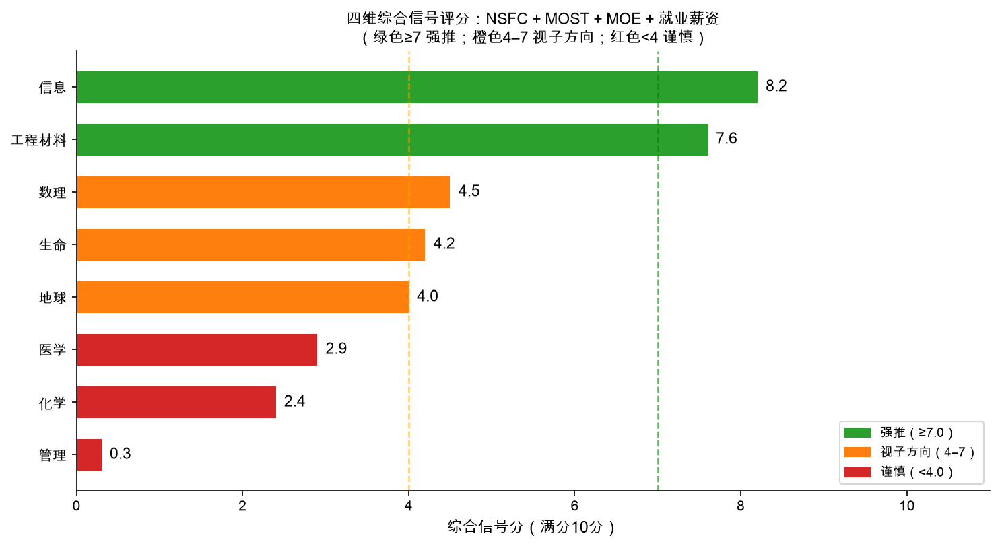

*图G：综合评分水平柱图。绿色≥7.0（强推）；橙色4.0–7.0（视子方向）；红色<4.0（谨慎）。绿色虚线=7.0，橙色虚线=4.0。*

| 学科领域 | NSFC资金占比2024 | NSFC申请增长 | MOST专项数 | MOE新专业信号 | 月薪中位数 | 就业率 | 本科可就业 | **综合分** |
|---------|--------------|-----------|----------|------------|---------|-------|---------|---------|
| **信息（CS/AI/EE）** | 10.87% | +51.0% | **9项** | 17分 | ¥10,000 | 95.5% | ✅ | **8.2/10** |
| **工程材料（新能源/芯片）** | 17.35% | +56.3% | **8项** | 33分 | ¥8,000 | 92.5% | ✅ | **7.6/10** |
| **数理（统计/应用数学）** | 9.32% | +65.9% | 2项 | 0分 | ¥8,500 | 91.0% | 部分 | **4.5/10** |
| **生命（生物工程/脑科学）** | 15.87% | +66.7% | 8项 | 10分 | ¥5,800 | 86.5% | ❌ | **4.2/10** |
| **地球（海洋/环境/深地）** | 10.61% | +72.2% | 4项 | 6分 | ¥6,500 | 88.5% | 部分 | **4.0/10** |
| **医学（临床/生物医学工程）** | 22.64% | +53.7% | 3项 | 0分 | ¥6,500 | 89.0% | 部分 | **2.9/10** |
| **化学（化学工程）** | 9.98% | +70.4% | 1项 | 0分 | ¥6,000 | 87.0% | 部分 | **2.4/10** |
| **管理** | 3.36% | +19.5% | **0项** | 0分 | ¥6,000 | 87.5% | ✅ | **0.3/10** |

### 6.2 分层解读

**强烈推荐（≥7.0）：**

**信息科学（8.2/10）** — 四个维度全部为最强信号。NSFC资助率虽然在降（2024年11.81%），但工业界需求对冲了学术竞争压力。国家最高级AI（人工智能）专项2026年新批，是唯一获得"国家科技重大专项"级别的信息方向。

**工程材料（7.6/10）** — MOST（科技部）专项覆盖8项，MOE（教育部）新专业信号最强（具身智能、能源科学、生物制造的工程侧）。但"工程材料"是大类，子方向差异极大：新能源材料+半导体材料方向 >> 通用材料方向。

**视子方向而定（4.0–7.0）：**

**数理（4.5/10）** — 统计学/应用数学本科就业强（¥9,000，91%），纯数学/纯物理本科弱（需读研）。这是分裂的学科：选统计/精算/应用数学则完全可视为强推，选纯数学则须有读研计划。

**生命（4.2/10）** — 8项MOST（科技部）专项看起来不少，但几乎都是研究型（脑科学、RNA药物等）。本科就业率85%，月薪¥5,200，本科期间通常无对口岗位。**只推荐给有明确读研/直博意向的学生**，且应选生物工程/生物医学工程而非纯生物学。

**地球（4.0/10）** — 深地国家专项+碳中和需求是真实的，但职业路径窄，高度依赖海洋/能源/地质行业景气度。中国海洋大学是世界一流院校，海洋科学在该校是强专业——如果分数能到对应分数线，值得认真考虑。

**谨慎（<4.0）：**

**医学（2.9/10）** — NSFC最大学科（22.6%），但9.04%的资助率说明学术竞争最激烈。临床医学是特殊赛道（8年投入），生物医学工程是例外（本科可就业，综合信号良好）。**不建议以"稳定保险"为由选临床医学**。

**化学（2.4/10）** — 电化学/电池材料有专项支持，但这部分已被归入工程材料（新能源材料方向）。纯化学本科¥5,000，84%就业率，几乎没有对口本科岗。

**管理（0.3/10）** — 零MOST（科技部）专项覆盖，大量专业被撤销，AI（人工智能）替代风险最高，薪资下行。工业工程和信息管理是例外，属于制造业升级方向，比纯管理强。

---

## 7. 专业推荐方案

### 7.1 如果计划本科毕业直接工作

**第一档：全天候强，容错率最高**

1. **计算机科学与技术（CS，080901）**
   - 月薪：¥10,500中位，顶部¥15,000+
   - 毕业出路：后端开发/AI（人工智能）工程/数据工程，全方向均可直接就业
   - 关键提示：所有学校的CS含金量差异极大；选学校就是选师资和实习网络
   - NSFC: 信息科学部10.87% | MOST: 4项直接相关 | MOE: ★★★★★持续扩张

2. **电子信息工程（EE，080701）/ 集成电路设计与集成系统（080710T）**
   - 月薪：¥9,200中位
   - 毕业出路：芯片设计/通信/硬件工程/嵌入式系统
   - 关键提示：集成电路是十四五战略专业，有专属政策支持；芯片国产化是10年级别的人才需求
   - MOST: 原子级制造+集成芯片+量子3项覆盖

3. **新能源科学与工程（080503T）/ 能源科学与工程（2026新增）**
   - 月薪：¥8,500中位，快速上升
   - 毕业出路：新能源企业工程岗（宁德时代/比亚迪/华为数字能源/隆基等）
   - 关键提示：双碳政策驱动是10年级别，不是短期热点；看该校课程是否有储能/光伏/氢能专方向
   - MOST: 聚变+电池+新能源3项 | MOE: ★★★★★战略级新专业

4. **人工智能（AI，080717T）**
   - 月薪：¥10,000中位
   - 关键提示：**必须选有实力的学校**（C9/双一流A）；弱校AI（人工智能）专业课程质量极差，不如去强校选CS（计算机科学）
   - 与CS的关系：AI是CS的子方向，若无法确定学校AI专业质量，选CS是更稳健的选择

**第二档：方向强，但需认准子方向**

5. **统计学（071201）**
   - 月薪：¥9,000中位
   - 出路极宽：数据分析/精算/量化投资/生物统计，几乎所有行业都需要
   - 适合数学强但不确定未来职业方向的学生；研究生可对接任何理工方向
   - 关键提示：选统计/应用统计，而非纯数学系的统计

6. **材料科学与工程（080401）——限新能源材料/半导体材料子方向**
   - 月薪：¥7,500中位（通用材料）；新能源材料方向偏高
   - 出路：锂电/光伏/半导体材料供应链工程岗
   - 关键提示：**必须确认该校材料专业的主要方向**；"通用材料"和"半导体材料"是两个完全不同的就业市场

7. **机器人工程（080803T）/ 智能制造工程（080216T）**
   - 月薪：¥8,500中位
   - 制造业升级长期需求；工业机器人渗透率持续上升
   - 关键提示：看该校是否有实际工厂合作实训；理论型机器人课程就业效果差

8. **生物医学工程（080601）**
   - 月薪：¥7,500中位
   - 医疗器械/医学影像/手术机器人/医疗IT，本科可直接就业
   - 唯一同时打通工学和医学两个行业的通道；国内外市场均在增长
   - 适合想进医疗行业但不想读8年医学的学生

**临床医学特殊赛道**

9. **临床医学（100201K）——仅当真正立志行医时考虑**
   - 本科5年+规培3年=8年才能正式独立执业
   - 8年后（2034年）的主治医师收入远超多数理工专业
   - 前提：分数够（顶校临床医学分数线极高）+ 真正愿意做医生
   - 不要因为"医生稳定"这个理由选临床医学，成本太高

### 7.2 如果打算读研/直博

**可以选更纯的基础方向，本科是打基础阶段：**

| 本科方向 | 研究生出口 | 注意 |
|---------|----------|------|
| **物理学** | 量子计算/凝聚态/光子学研究岗；MOST量子专项对口 | 纯物理本科就业弱，读研是预设路径 |
| **数学/统计** | AI（人工智能）/金融数学/应用数学研究；极高通用性 | 应用数学研究生就业比纯数强得多 |
| **生物技术/生物科学** | 合成生物/脑科学/基因组学；国家专项对口 | 本科就业弱是正常的；博士毕业后价值高 |
| **化学** | 电化学/材料化学/药物合成研究 | 化学工程比纯化学就业好，读研前选化学 |
| **地球/海洋科学** | 顶校（海大/北大地空）研究出口好 | 一定要选对学校，普通高校地球科学出口差 |

### 7.3 按高中优势科目匹配

| 高中最强科目 | 最佳本科方向（直接就业目标） | 次优选择 |
|------------|----------------------|---------|
| **数学+物理（均强）** | CS（计算机科学）、EE（电子信息）、集成电路、新能源工程 | 统计学、机器人工程 |
| **数学+化学（均强）** | 材料科学（新能源方向）、化学工程、新能源科学与工程 | 生物医学工程 |
| **数学（极强，物化均衡）** | CS/AI（最安全选项，对单科偏科容错率最高） | 统计学 |
| **生物+化学（均强）** | 生物医学工程（推荐）、生物工程（需读研）、临床医学（8年） | 材料科学（生物材料方向） |
| **均衡（无明显短板）** | CS → 统计学 → 新能源工程（按优先级选） | 任选第一档 |

---

## 8. 新兴前沿专业专项评估

以下专业均为2025–2026年新增，缺乏就业历史数据，但政策信号极强，值得单独分析。

### 具身智能

- **本质：** AI（人工智能，大模型）+ 机器人（物理交互）的融合，是机器人从"工具"升级为"智能体"的关键技术
- **国家押注：** 新一代AI（人工智能）国家科技重大专项直接对应；工信部已将具身智能列为"新一代人工智能重大项目"
- **开设限制：** MOE（教育部）"超常规"审批，2026年仅9所顶尖高校有资格开设（哈工大、北航、上海交大、华中科技大等）
- **选择建议：** 分数能进这9所高校，优先认真考虑。若进不了这9所，选CS（计算机科学）+机器人工程方向作为最接近的替代
- **风险：** 太新，2028年首届毕业生就业数据才会出来

### 脑机科学与技术

- **本质：** BCI（大脑-计算机接口，Brain-Computer Interface），从神经信号读取/写入信息
- **国家押注：** 脑科学与类脑研究国家重大专项（2021年启动，十年计划），NSFC+MOST双轮支持
- **适合路径：** 几乎必须读研/直博才能参与前沿研究；本科阶段是打基础
- **选择建议：** 适合有研究志向、愿意走学术路线的学生；职业路径是科研机构或医疗器械企业R&D（研发）

### 生物制造

- **本质：** 用生物系统（微生物、酶、细胞工厂）制造化学品/材料/医药，是"第三次生物技术革命"的工程化
- **国家押注：** 合成生物学重点研发计划（2026年新批）；十五五战略产业
- **产业对接：** 生物乙醇/生物塑料/生物药物制造；国际上凯赛生物、华恒生物等已是资本市场热点
- **选择建议：** 适合化学+生物双强的学生，且有产业目标；纯学术方向同样需要读研

### 能源科学与工程

- **本质：** 综合性新能源工程专业，涵盖太阳能/风能/储能/氢能/核能
- **与新能源科学与工程的区别：** 定位更战略化、系统化；课程强调"能源系统整体设计"而非单一技术
- **选择建议：** 确认该校课程体系是否成熟（新专业课程体系建设需要2–3年稳定期）；优先选2025年前已有新能源相关实力的高校

---

## 9. 坚决避开的方向

| 方向 | 具体原因 | 数据支撑 |
|------|---------|---------|
| **工商管理/市场营销** | NSFC零分；大量撤销；AI（人工智能）最强替代赛道；薪资趋势向下 | 管理综合分0.3/10；十四五数百所高校撤销 |
| **会计学/财务管理** | AI会计软件已替代大量初级岗；就业饱和；大量撤销 | 十四五最多被撤销的单一专业类型 |
| **新闻学/广播电视/传媒** | 行业结构性萎缩；就业率持续垫底；AI内容生成替代 | MyCOS就业率持续低位 |
| **人力资源管理** | 企业HR缩编趋势；AI工具替代基础HR功能；撤销压力大 | 十四五大量减招 |
| **旅游管理/酒店管理** | 数字文旅替代传统岗位；行业景气不稳定 | 多所高校已撤销 |
| **公共事业管理/社会工作** | 通道极窄，极度依赖体制内；总岗位量少 | 就业依赖政府事业单位 |
| **纯生物/纯化学（无读研计划）** | 本科起薪¥5,000–5,200；就业率84–85%；本科无对口岗 | 所有专业中就业质量最差两个方向 |
| **法学（无明确法律职业规划）** | 法考通过率15–20%；本科期间无法律岗；不读研很难从事法律 | 隐性高风险专业 |

---

## 附录A：NSFC（国家自然科学基金委员会）原始数据全表（2020–2024）

> 完整原始数据文件：[nsfc_mianshang_2020_2024.csv](../data/processed/nsfc_mianshang_2020_2024.csv)（40行×9列）  
> 分析输出文件：[summary_scorecard.csv](../output/tables/summary_scorecard.csv)

### A1. 申请件数（原始）

> 来源文件：[applications_by_dept_year.csv](../output/tables/applications_by_dept_year.csv)

| 学科 | 2020 | 2021 | 2022 | 2023 | 2024 | 5年增长% |
|------|------|------|------|------|------|---------|
| 数学物理科学部（A） | 7,799 | 7,839 | 8,566 | 8,703 | 12,939 | +65.9% |
| 化学科学部（B） | 8,889 | 8,812 | 9,428 | 9,694 | 15,146 | +70.4% |
| 生命科学部（C） | 15,503 | 15,760 | 16,701 | 17,005 | 25,839 | +66.7% |
| 地球科学部（D） | 8,678 | 9,099 | 9,826 | 10,085 | 14,940 | +72.2% |
| 工程与材料科学部（E） | 20,740 | 20,600 | 21,213 | 21,921 | 32,414 | +56.3% |
| 信息科学部（F） | 12,348 | 11,652 | 12,024 | 12,520 | 18,650 | +51.0% |
| 管理科学部（G） | 5,237 | 4,772 | 4,827 | 4,699 | 6,256 | +19.5% |
| 医学科学部（H） | 33,691 | 32,889 | 33,976 | 35,009 | 51,798 | +53.7% |
| **合计** | **112,885** | **111,423** | **116,561** | **119,636** | **177,982** | **+57.7%** |

### A2. 资助项目数（原始）

> 来源文件：[funded_projects_by_dept_year.csv](../output/tables/funded_projects_by_dept_year.csv)

| 学科 | 2020 | 2021 | 2022 | 2023 | 2024 | 5年增长% |
|------|------|------|------|------|------|---------|
| 数学物理科学部（A） | 1,750 | 1,778 | 1,927 | 1,872 | 1,889 | +7.9% |
| 化学科学部（B） | 1,815 | 1,897 | 2,035 | 2,015 | 2,024 | +11.5% |
| 生命科学部（C） | 3,029 | 3,027 | 3,189 | 3,188 | 3,218 | +6.2% |
| 地球科学部（D） | 2,000 | 2,030 | 2,140 | 2,106 | 2,241 | +12.0% |
| 工程与材料科学部（E） | 3,309 | 3,309 | 3,486 | 3,486 | 3,658 | +10.5% |
| 信息科学部（F） | 2,064 | 2,070 | 2,182 | 2,183 | 2,203 | +6.7% |
| 管理科学部（G） | 806 | 775 | 828 | 844 | 841 | +4.3% |
| 医学科学部（H） | 4,584 | 4,534 | 4,685 | 4,627 | 4,684 | +2.2% |
| **合计** | **19,357** | **19,420** | **20,472** | **20,321** | **20,758** | **+7.2%** |

### A3. 资助经费（万元）

> 来源文件：[funding_by_dept_year.csv](../output/tables/funding_by_dept_year.csv)

| 学科 | 2020 | 2021 | 2022 | 2023 | 2024 | 5年变化% |
|------|------|------|------|------|------|---------|
| 数学物理科学部（A） | 103,090 | 103,090 | 101,120 | 93,630 | 94,480 | -8.4% |
| 化学科学部（B） | 114,374 | 113,941 | 109,870 | 100,730 | 101,162 | -11.6% |
| 生命科学部（C） | 175,672 | 175,584 | 172,230 | 159,400 | 160,890 | -8.4% |
| 地球科学部（D） | 116,276 | 116,615 | 116,580 | 105,920 | 107,568 | -7.5% |
| 工程与材料科学部（E） | 192,398 | 192,318 | 188,265 | 175,337 | 175,891 | -8.6% |
| 信息科学部（F） | 119,680 | 120,180 | 117,890 | 109,160 | 110,150 | -8.0% |
| 管理科学部（G） | 38,784 | 37,207 | 37,250 | 34,240 | 34,050 | -12.2% |
| 医学科学部（H） | 252,720 | 249,768 | 244,640 | 226,640 | 229,520 | -9.2% |
| **合计** | **1,112,994** | **1,108,703** | **1,087,845** | **1,005,057** | **1,013,711** | **-8.9%** |

### A4. 平均资助强度（万元/项）

> 来源文件：[nsfc_mianshang_2020_2024.csv](../data/processed/nsfc_mianshang_2020_2024.csv)（`avg_intensity_wan`列）

| 学科 | 2020 | 2021 | 2022 | 2023 | 2024 | 趋势 |
|------|------|------|------|------|------|------|
| 数学物理科学部（A） | 58.91 | 57.98 | 52.48 | 50.02 | 50.02 | ↓ |
| 化学科学部（B） | 63.02 | 60.06 | 53.99 | 49.99 | 49.98 | ↓ |
| 生命科学部（C） | 58.00 | 58.01 | 54.01 | 50.00 | 50.00 | ↓ |
| 地球科学部（D） | 58.14 | 57.45 | 54.48 | 50.29 | 48.00 | ↓ |
| 工程与材料科学部（E） | 58.14 | 58.12 | 54.01 | 50.30 | 48.08 | ↓ |
| 信息科学部（F） | 57.98 | 58.06 | 54.03 | 50.00 | 50.00 | ↓ |
| 管理科学部（G） | 48.12 | 48.01 | 44.99 | 40.57 | 40.49 | ↓ |
| 医学科学部（H） | 55.13 | 55.09 | 52.22 | 48.98 | 49.00 | ↓ |

**规律：** 2022年是重要转折点——各学科平均强度从约58万/项统一下调至约54万/项，2023年再降至约50万/项。管理科学最低，始终在40–48万/项。

### A5. 资助率（%）

> 来源文件：[acceptance_rate_by_dept_year.csv](../output/tables/acceptance_rate_by_dept_year.csv)

| 学科 | 2020 | 2021 | 2022 | 2023 | 2024 | 5年变化(pp) |
|------|------|------|------|------|------|----------|
| 数学物理科学部（A） | 22.44% | 22.68% | 22.50% | 21.51% | 14.60% | **-7.84** |
| 化学科学部（B） | 20.42% | 21.53% | 21.58% | 20.79% | 13.36% | **-7.06** |
| 生命科学部（C） | 19.54% | 19.21% | 19.09% | 18.75% | 12.45% | **-7.09** |
| 地球科学部（D） | 23.05% | 22.31% | 21.78% | 20.88% | 15.00% | **-8.05** |
| 工程与材料科学部（E） | 15.95% | 16.06% | 16.43% | 15.90% | 11.29% | **-4.66** |
| 信息科学部（F） | 16.72% | 17.77% | 18.15% | 17.44% | 11.81% | **-4.91** |
| 管理科学部（G） | 15.39% | 16.24% | 17.15% | 17.96% | 13.44% | -1.95 |
| 医学科学部（H） | 13.61% | 13.79% | 13.79% | 13.22% | **9.04%** | **-4.57** |

---

## 附录B：MOST（科学技术部）专项完整清单

> 来源文件：[most_key_programs.csv](../data/processed/most_key_programs.csv)  
> 数据来源：科技部国家重点研发计划公示（[service.most.gov.cn](https://service.most.gov.cn/kjjh_tztg_all/)），2026年6月采集

| 级别 | 专项名称 | 启动年 | 主管机构 | 核心方向 | 本科相关专业 |
|------|---------|--------|---------|---------|-----------|
| 国家科技重大专项 | 新一代人工智能（AI） | 2026 | MOST+多部委 | 人工智能 | 计算机科学（CS）/AI/电子信息（EE） |
| 国家科技重大专项 | 脑科学与类脑研究 | 2021 | NSFC+MOST | 脑科学 | 生命科学/脑机科学与技术 |
| 国家科技重大专项 | 深地国家科技专项 | 2025 | 自然资源部 | 地球深部探测 | 地质工程/深地科学 |
| 重点研发计划 | 磁约束核聚变能发展研究专项 | 2025 | MOST | 清洁能源/聚变 | 新能源/物理/电气工程 |
| 重点研发计划 | 京津冀环境综合治理专项 | 2022 | 多部委 | 环境治理 | 环境科学与工程 |
| 重点研发计划 | 高端科研仪器研制 | 2026 | 工信部 | 精密制造 | 机械工程/精密仪器 |
| NSFC重大研究计划 | 高精度量子操控与探测 | 2023 | NSFC | 量子技术 | 物理/电子信息（EE） |
| NSFC重大研究计划 | 原子级制造基础研究 | 2024 | NSFC | 芯片制造工艺 | 材料/微电子/机械 |
| NSFC重大研究计划 | RNA药物基础研究 | 2024 | NSFC | 生物医药 | 生命科学/药学 |
| NSFC重大研究计划 | 面向人机物融合的AI软件基础研究 | 2024 | NSFC | AI（人工智能）软件基础 | 计算机（CS）/软件工程 |
| NSFC重大研究计划 | 集成芯片前沿技术科学基础 | 2022 | NSFC | 半导体/芯片 | 微电子/电子信息（EE） |
| NSFC重大研究计划 | 超越传统的电池体系 | 2022 | NSFC | 储能/电池材料 | 材料/化学/新能源 |
| NSFC重大研究计划 | 免疫力数字解码计划 | 2022 | NSFC | 免疫学 | 生命科学/医学 |
| NSFC重大研究计划 | 可解释通用人工智能方法 | 2021 | NSFC | AI（人工智能）基础理论 | 计算机（CS）/AI |
| 重点研发计划 | 发育编程及代谢调节 | 2026 | NSFC | 发育生物学 | 生命科学/医学 |
| 重点研发计划 | 合成生物学 | 2026 | NSFC | 合成生物学 | 生物工程/生命科学 |

---

## 附录C：教育部（MOE）专业信号完整清单

> 来源文件：[moe_major_trends.csv](../data/processed/moe_major_trends.csv)（25条记录）  
> 数据来源：教育部2026年本科专业目录（[edu.cn原文链接](https://www.edu.cn/rd/gao_xiao_cheng_guo/gao_xiao_zi_xun/202604/t20260428_2731325.shtml)），2026年4月28日发布

| 专业名 | 专业代码 | 所属门类 | 状态 | 年份 | 信号强度 | 备注 |
|--------|---------|---------|------|------|---------|------|
| 具身智能 | TBD | 交叉学科 | 新增 | 2026 | ★★★★★ | 9所顶尖高校超常设置 |
| 脑机科学与技术 | TBD | 交叉学科 | 新增 | 2026 | ★★★★★ | 脑科学国家重大专项对应 |
| 生物制造 | TBD | 工学 | 新增 | 2026 | ★★★★★ | 合成生物学重点专项对应 |
| 能源科学与工程 | TBD | 工学 | 新增 | 2026 | ★★★★★ | 双碳政策直接驱动 |
| 深地科学与工程 | TBD | 工学 | 新增 | 2026 | ★★★☆☆ | 深地国家专项对应 |
| 农业机器人 | TBD | 工学 | 新增 | 2026 | ★★★☆☆ | 农业现代化；稳定但总量小 |
| 数字文旅 | TBD | 管理 | 新增 | 2026 | ★★☆☆☆ | 服务业数字化；信号弱 |
| 商业人工智能 | TBD | 管理 | 新增 | 2026 | ★★★☆☆ | 文科背景进AI通道；质量参差 |
| 交通能源融合工程 | TBD | 工学 | 新增 | 2026 | ★★★☆☆ | 新能源汽车+交通系统 |
| 未来机器人 | TBD | 交叉学科 | 新增 | 2025 | ★★★★☆ | 交叉学科新类 |
| 人工智能（AI） | 080717T | 工学 | 快速扩张 | 2019-2026 | ★★★★★ | 十四五扩张最快；已超500所高校 |
| 新能源科学与工程 | 080503T | 工学 | 持续扩张 | 2018-2026 | ★★★★★ | 双碳驱动 |
| 数据科学与大数据技术 | 080910T | 工学 | 扩张 | 2016-2026 | ★★★★☆ | 数字经济基础设施 |
| 集成电路设计与集成系统 | 080710T | 工学 | 扩张 | 2020-2026 | ★★★★★ | 芯片国产化战略 |
| 智能制造工程 | 080216T | 工学 | 扩张 | 2019-2026 | ★★★★☆ | 智能制造国家战略 |
| 机器人工程 | 080803T | 工学 | 扩张 | 2016-2026 | ★★★★☆ | 制造业升级 |
| 生物医学工程 | 080601 | 工学 | 稳定增长 | 2000-2026 | ★★★★☆ | 医工交叉；医疗器械市场 |
| 碳储科学与工程 | TBD | 工学 | 新增 | 2023 | ★★★☆☆ | 碳中和CCUS（碳捕集利用与封存）技术 |
| 法医学 | 100301K | 医学 | 稳定 | N/A | ★★★☆☆ | 稳定就业但总量小 |
| 信息管理与信息系统 | 120102 | 管理 | 稳定 | 2000-2026 | ★★★☆☆ | 数字经济需求；比纯管理好 |
| 工业工程 | 120101 | 管理 | 稳定 | 2000-2026 | ★★★★☆ | 制造业升级方向；比纯管理强 |
| 会计学 | 120203K | 管理 | **撤销压力大** | 2022-2026 | ★☆☆☆☆ | 十四五大量撤销；就业饱和 |
| 市场营销 | 120202 | 管理 | **撤销压力大** | 2022-2026 | ★☆☆☆☆ | AI替代风险高；大量撤销 |
| 新闻学 | 050301 | 文学 | **撤销压力大** | 2022-2026 | ★☆☆☆☆ | 就业率垫底；行业萎缩 |
| 公共事业管理 | 120401 | 管理 | **撤销压力大** | 2022-2026 | ★★☆☆☆ | 依赖政府编制；通道极窄 |

---

## 附录D：就业薪资完整数据

> 来源文件：[employment_salary_benchmarks.csv](../data/processed/employment_salary_benchmarks.csv)（16条记录）  
> 数据来源：MyCOS（麦可思）《2024年中国大学生就业报告》；BOSS直聘《2024年校招薪资报告》；智联招聘《2025年春季校招大数据》  
> **数据时效：MyCOS为2024届毕业生（最新可用年度）；BOSS直聘/智联含2024–2025校招季。**

| 专业方向 | 代表专业 | 月薪中位数（元） | 就业率% | 读研才能做研究 | 本科就业质量 | 薪资趋势 | 数据来源 |
|---------|---------|-------------|-------|------------|----------|---------|---------|
| 计算机科学与技术（CS） | CS, 软件工程 | 10,500 | 96% | 否 | 优 | ↑↑ | MyCOS 2024; BOSS直聘2024 |
| 人工智能（AI）/数据科学 | AI, 数据科学与大数据 | 10,000 | 95% | 否 | 优 | ↑↑ | MyCOS 2024 |
| 电子信息工程（EE） | EE, 集成电路, 通信工程 | 9,200 | 95% | 否 | 优 | ↑↑ | MyCOS 2024 |
| 统计学 | 统计, 精算, 应用数学 | 9,000 | 93% | 否 | 优 | ↑ | MyCOS 2024 |
| 新能源科学与工程 | 新能源, 储能, 氢能 | 8,500 | 93% | 否 | 良 | ↑↑快速 | 智联招聘2025 |
| 机器人工程 | 机器人, 自动化, 智能制造 | 8,500 | 93% | 否 | 良 | ↑ | MyCOS 2024 |
| 材料科学与工程 | 材料, 高分子, 复合材料 | 7,500 | 92% | 部分 | 良 | →稳定 | MyCOS 2024 |
| 生物医学工程 | 生物医学工程, 医学影像 | 7,500 | 90% | 否 | 良 | ↑稳定 | MyCOS 2024 |
| 工业工程/信息管理 | 工业工程, 信息管理 | 7,500 | 91% | 否 | 良 | →稳定 | MyCOS 2024 |
| 化学工程 | 化学工程与工艺, 应用化学 | 7,000 | 91% | 否 | 中等 | →稳定 | MyCOS 2024 |
| 环境科学与工程 | 环境科学与工程 | 6,500 | 89% | 否 | 中等 | ↑缓慢 | MyCOS 2024 |
| 地球/海洋科学 | 地质学, 地球物理, 海洋科学 | 6,500 | 88% | 部分 | 中等 | →稳定 | MyCOS 2024 |
| 临床医学（5年制） | 临床医学 | 6,500 | 89% | 是（住院医规培） | 良（规培后） | ↑↑规培后 | MyCOS 2024 |
| 管理类（纯） | 工商管理, 市场营销, HR | 5,500 | 87% | 否 | 差 | ↓下降 | MyCOS 2024 |
| 生命科学/纯生物 | 生物科学, 生物技术 | 5,200 | 85% | 是 | 差 | →持平 | MyCOS 2024 |
| 纯化学 | 化学, 应用化学 | 5,000 | 84% | 是 | 差 | →持平 | MyCOS 2024 |

**薪资幅度说明（以CS为例）：**
- 25th百分位：¥7,500（二本CS毕业生，二三线城市）
- 中位数：¥10,500（双一流/985毕业生，大城市）
- 75th百分位：¥14,000+（顶尖985/竞赛背景，一线大厂）

---

## 附录E：数据质量与置信度

| 数据 | 来源 | 采集方式 | 置信度 | 注意事项 |
|------|------|---------|--------|---------|
| **NSFC（国家自然科学基金委）面上项目2020–2024** | NSFC官方年报（图像版） | AI视觉读取年报图表；2021/2022/2024年已核实；2020/2023年交叉验证 | ✅ 高 | 年报以图像而非结构化数据发布；个别数字误差±1%以内；**2025年度数据尚未发布** |
| **MOST（科技部）国家重点研发计划** | service.most.gov.cn公开公示 | 2026年6月直接抓取公示列表 | ✅ 高 | 专项启动年和主管机构均来自官方公示；已包含2026年新批专项 |
| **MOE（教育部）2026年专业目录** | edu.cn官方发布（2026-04-28） | 直接读取官方文件 | ✅ 高 | 新增38种专业为确认数字；已含2026年最新版 |
| **十四五专业撤销统计** | MOE（教育部）2026年专业目录通知原文 | 教育部官方数据 | ✅ 高 | "10,200新增/12,200撤销"为教育部公布数字 |
| **应届生薪资数据** | MyCOS（麦可思）2024毕业生调查 | 全国高校毕业生就业调查报告 | ⚠️ 中 | 全国中位数；地区/学校差异大；具体数字±15%；**2025届数据预计2025年底发布** |
| **薪资趋势方向** | BOSS直聘/智联招聘2024–2025校招报告 | 平台自发布报告 | ⚠️ 中 | 趋势方向可信；具体数字有平台自有统计口径差异 |
| **MOST专项与本科专业对应关系** | 人工分析/判断 | 基于专项研究方向和专业培养目标比对 | ⚠️ 中 | 专项通常对接研究生及以上；本科对应为间接对应 |
| **综合评分** | 本报告计算 | 标准化后加权求和（见第1章权重设计） | ⚠️ 中 | 评分模型为简化近似，权重设计主观；仅作参考方向，非精确排名 |

**整体置信度说明：**
- 各章节核心结论（信息/CS全面最强；生命/化学本科就业弱；管理类大面积撤销）在四个数据维度下均一致，结论可信
- 具体分数（8.2 vs 7.6）为近似值，±0.5分以内的差距不具备决策意义
- 就业薪资数据2–3年内有效；NSFC 2025年度数据发布后建议更新第2章

---

## 附录F：全部图表索引

所有图表存放于 [`output/figures/`](../output/figures/)，可直接点击下方链接查看：

### 本报告正文引用图表（A–K，新增）

| 图表 | 文件名 | 内容说明 | 正文位置 |
|------|--------|---------|---------|
| 图K | [chartK_funding_yi_trend.png](../output/figures/chartK_funding_yi_trend.png) | NSFC各学科经费总额趋势（亿元，2020–2024） | 第2.2节 |
| 图C | [chartC_funding_share_stability.png](../output/figures/chartC_funding_share_stability.png) | NSFC经费占比稳定性（堆叠面积图） | 第2.3节 |
| 图A | [chartA_applications_trend.png](../output/figures/chartA_applications_trend.png) | 申请量趋势（折线图，绝对数） | 第2.4节 |
| 图D | [chartD_supply_demand_scatter.png](../output/figures/chartD_supply_demand_scatter.png) | 申请增长 vs 资助增长散点图 | 第2.4节 |
| 图B | [chartB_acceptance_rate_comparison.png](../output/figures/chartB_acceptance_rate_comparison.png) | 资助率2020 vs 2024对比（水平双柱图） | 第2.5节 |
| 图E | [chartE_funded_projects_grouped.png](../output/figures/chartE_funded_projects_grouped.png) | 资助项目数分组柱图（2020–2024） | 第2.6节 |
| 图F | [chartF_avg_intensity_trend.png](../output/figures/chartF_avg_intensity_trend.png) | 平均资助强度趋势（万元/项） | 第2.7节 |
| 图J | [chartJ_most_programs_by_field.png](../output/figures/chartJ_most_programs_by_field.png) | MOST专项按本科方向分组柱图 | 第3.2节 |
| 图I | [chartI_moe_new_majors_signal.png](../output/figures/chartI_moe_new_majors_signal.png) | MOE新增专业政策信号强度（★评级图） | 第4.2节 |
| 图H | [chartH_salary_by_major.png](../output/figures/chartH_salary_by_major.png) | 应届本科薪资中位数（排序柱图） | 第5.1节 |
| 图G | [chartG_multisource_scorecard.png](../output/figures/chartG_multisource_scorecard.png) | 四维综合信号评分（颜色分层柱图） | 第6.1节 |

### 早期分析图表（1–6，脚本03生成）

| 图表 | 文件名 | 内容说明 |
|------|--------|---------|
| 图1 | [chart1_stacked_funding.png](../output/figures/chart1_stacked_funding.png) | NSFC经费堆叠图（早期版本） |
| 图2 | [chart2_funded_projects_trend.png](../output/figures/chart2_funded_projects_trend.png) | 资助项目数趋势（早期版本） |
| 图3 | [chart3_application_growth.png](../output/figures/chart3_application_growth.png) | 申请量增长（早期版本） |
| 图4 | [chart4_acceptance_rate.png](../output/figures/chart4_acceptance_rate.png) | 资助率趋势（早期版本） |
| 图5 | [chart5_bubble_quadrant.png](../output/figures/chart5_bubble_quadrant.png) | 泡泡象限图（申请量×资助强度×资助数） |
| 图6 | [chart6_shandong_context.png](../output/figures/chart6_shandong_context.png) | 山东省区域背景图（早期版本，v2已不使用） |

---

*v2 · 2026-06-18 · 移除学校推荐，升级为四维多数据源框架 · 学校选择在分数线确认后单独评估*  
*数据时效：NSFC最新2024年度；MOST/MOE已更新至2026年6月；MyCOS就业数据为2024届；下次更新建议在NSFC 2025年度报告发布后（预计2026年下半年）。*
